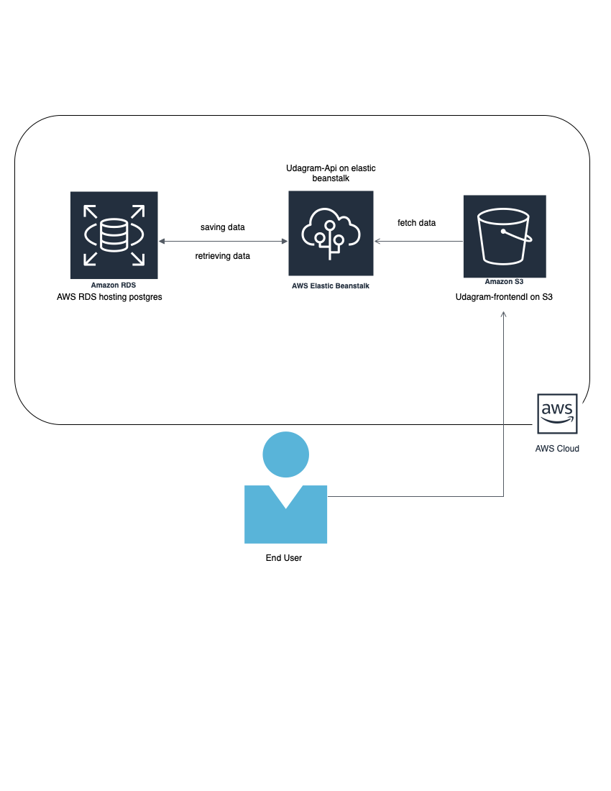

# Infrastructure

This site is hosted on AWS using simple infrastructure to host the UI on S3, The API on the elastic beanstalk, the database on RDS postgres, and automation using CircleCI

<p align="center">

<p align="center">AWS Infrastructure</p>
</p>


# AWS Configuration

## IAM User

### Steps

- Go to [IAM](https://console.aws.amazon.com/iamv2/home?#/home) - Identity and Access Management (IAM)
- Select `Users` -> Click `Add user`
- Under `Select AWS access type` check the `Access key - Programmatic access`
- Click `Next: Permissions`
- Under `Set permissions` section select user `Group` the user that has `AdministratorAccess` policies.
- If group does not exist click on `Create Group` and add name with `AdministratorAccess` police.   
- Then click on `Next: Tags` -> Skip tags -> Then click on `Next: Review`
- Finally click on `Create user`
- After that you will got two keys keep it save as we will use it with CircleCI.
    - AWS_ACCESS_KEY_ID
    - AWS_SECRET_ACCESS_KEY
    - AWS_DEFAULT_REGION

### Pre-requisites

1. You must have the AWS and the EB CLI installed. tutorials [here](https://docs.aws.amazon.com/cli/latest/userguide/cli-chap-getting-started.html) and [here](https://docs.aws.amazon.com/elasticbeanstalk/latest/dg/eb-cli3-install.html).

2. Have a Node.js app ready to be deployed. You can create a sample app with [express-generator](https://expressjs.com/en/starter/generator.html).


## RDS

### Steps 

1. Create RDS [link](https://console.aws.amazon.com/rds/home)
2. make it public and add to inbound rules 0.0.0.0

## Elastic Beanstalk

### Steps 

1. Create an elastic beanstalk (EB) app and environment using EB cli
2. Create the deploy script. **Note:** would automatically done using the CircleCi. This command will deploy then set environments variables.

```bash
eb use ${ENV_NAME} --profile default
eb deploy --profile default
eb setenv AWS_ACCESS_KEY_ID=$AWS_ACCESS_KEY_ID AWS_REGION=$AWS_DEFAULT_REGION SECRET_ACCESS_KEY_ID=$AWS_SECRET_ACCESS_KEY --profile default
eb health
```

3. eb init will create a file `config,yml` under `.elasticbeanstalk` folder and fill it with this configuration.
eb init ${APP_Name} --platform node.js --region us-east-1 

```yml

deploy:
  artifact: www/archive.zip # you will add this line
```


## S3


### Steps 

1. Create Bucket first through this [link](https://s3.console.aws.amazon.com/s3/home)
2. Add this rule `Bucket policy` 

```json
{
    "Version": "2012-10-17",
    "Statement": [
        {
            "Sid": "PublicReadGetObject",
            "Effect": "Allow",
            "Principal": "*",
            "Action": "s3:GetObject",
            "Resource": "arn:aws:s3:::<BUCKET_NAME>/*"
        }
    ]
}
```

3. Deploy script

```bash
# Replace BUCKET_NAME with your bucket name
aws s3 cp --recursive ./client/build s3://<BUCKET_NAME>/
```

4. Configure CircleCI

First go to Project Page -> Project Settings -> Environment Variables then Add those variables.

- AWS_ACCESS_KEY_ID
- AWS_SECRET_ACCESS_KEY
- AWS_DEFAULT_REGION

